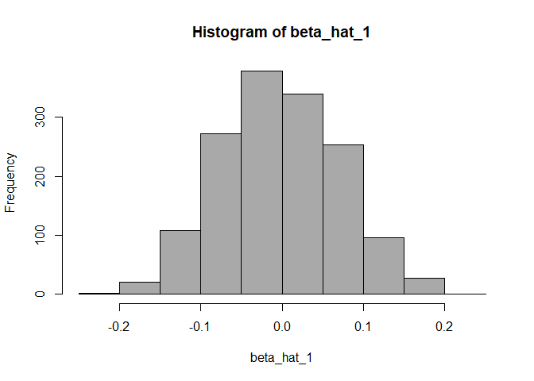
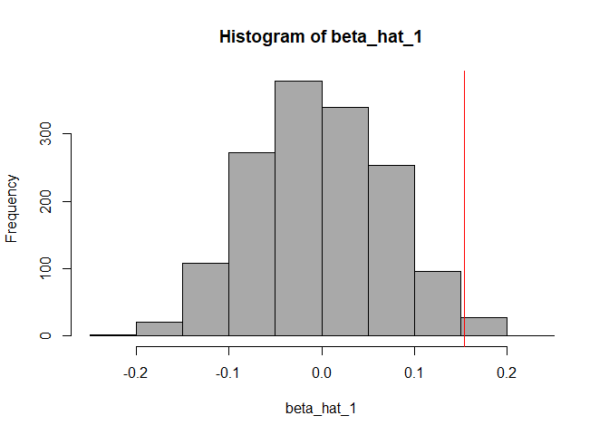

-   [Exercise 1 (Using `lm`)](#exercise-1-using-lm)
-   [Exercise 2 (Writing Functions)](#exercise-2-writing-functions)
-   [Exercise 3 (Simulating SLR)](#exercise-3-simulating-slr)
-   [Exercise 4 (Be a Skeptic)](#exercise-4-be-a-skeptic)
-   [Exercise 5 (Comparing Models)](#exercise-5-comparing-models)

Exercise 1 (Using `lm`)
-----------------------

For this exercise we will use the `cats` dataset from the `MASS` package. You should use `?cats` to learn about the background of this dataset.

**(a)** Suppose we would like to understand the size of a cat's heart based on the body weight of a cat. Fit a simple linear model in `R` that accomplishes this task. Store the results in a variable called `cat_model`. Output the result of calling `summary()` on `cat_model`.

``` r
library(MASS)
cat_model <- lm(Hwt~Bwt, data = cats)
summary(cat_model)
```

    ## 
    ## Call:
    ## lm(formula = Hwt ~ Bwt, data = cats)
    ## 
    ## Residuals:
    ##     Min      1Q  Median      3Q     Max 
    ## -3.5694 -0.9634 -0.0921  1.0426  5.1238 
    ## 
    ## Coefficients:
    ##             Estimate Std. Error t value Pr(>|t|)    
    ## (Intercept)  -0.3567     0.6923  -0.515    0.607    
    ## Bwt           4.0341     0.2503  16.119   <2e-16 ***
    ## ---
    ## Signif. codes:  0 '***' 0.001 '**' 0.01 '*' 0.05 '.' 0.1 ' ' 1
    ## 
    ## Residual standard error: 1.452 on 142 degrees of freedom
    ## Multiple R-squared:  0.6466, Adjusted R-squared:  0.6441 
    ## F-statistic: 259.8 on 1 and 142 DF,  p-value: < 2.2e-16

**(b)** Output only the estimated regression coefficients. Interpret *β*<sub>0</sub> and $\\hat{\\beta\_1}$ in the *context of the problem*. Be aware that only one of those is an estimate.

``` r
cat_model
```

    ## 
    ## Call:
    ## lm(formula = Hwt ~ Bwt, data = cats)
    ## 
    ## Coefficients:
    ## (Intercept)          Bwt  
    ##     -0.3567       4.0341

-   Note that here first number in lm call is intercept parameter *β*<sub>0</sub> = -0.3566624. This number tells us that the *mean* heart weight of cat with the body weight zero is -0.3566624.

-   $\\hat{\\beta\_1}$ which is of the slope parameter (an estimate in this case) tells us that for an increase of cat body weight of 1 Kg, the *mean* heart weight increases by $\\hat{\\beta\_1}$ which in this case is 4.0340627 grams.

**(c)** Use your model to predict the heart weight of a cat that weights **3.3** kg. Do you feel confident in this prediction? Briefly explain.

``` r
predict(cat_model, newdata = data.frame(Bwt=3.3))
```

    ##        1 
    ## 12.95574

-   By calling `predict` function, we are now predicting an estimated heart weight for a cat with body weight of `3.3 kg`. We feel comfortable with this estimated value of 12.9557445 grams, as this is one of observed body weight used in data.

**(d)** Use your model to predict the heart weight of a cat that weights **1.5** kg. Do you feel confident in this prediction? Briefly explain.

``` r
predict(cat_model, newdata = data.frame(Bwt=1.5))
```

    ##        1 
    ## 5.694432

-   By calling `predict` function again, we are predicting an estimated heart weight for a cat with body weight of `1.5 kg`. Although this predicted value seems reasonable, We are not confident with this prediction value of 5.6944316 grams, as this is the case of extrapolation i.e. body weight is outside the range of observed body weight used to build the model.

**(e)** Create a scatterplot of the data and add the fitted regression line. Make sure your plot is well labeled and is somewhat visually appealing.

``` r
reg <- lm(Hwt~Bwt, data = cats)
with(cats,plot(Hwt~Bwt,
                  xlab = "Body weight in Kg",
                  ylab = "Heart Weight in grams",
                  main = "Cat heart weight (in grams) vs body weight (in Kg)",
                  cex = 1,
                  col = "darkblue"))
abline(reg, col="darkorange", lwd=3)
```


**(f)** Report the value of *R*<sup>2</sup> for the model. Do so directly. Do not simply copy and paste the value from the full output in the console after running `summary()` in part **(a)**.

``` r
summary(cat_model)$r.squared
```

    ## [1] 0.6466209

-   The *R*<sup>2</sup> value of the model is 0.6466209

<br/>

Exercise 2 (Writing Functions)
------------------------------

This exercise is a continuation of Exercise 1.

**(a)** Write a function called `get_sd_est` that calculates an estimate of *σ* in one of two ways depending on input to the function. The function should take two arguments as input:

-   `model_resid` - A vector of residual values from a fitted model.
-   `mle` - A logical (`TRUE` / `FALSE`) variable which defaults to `FALSE`.

The function should return a single value:

-   *s*<sub>*e*</sub> if `mle` is set to `FALSE`.
-   $\\hat{\\sigma}$ if `mle` is set to `TRUE`.

``` r
get_sd_est <- function(model_resid,mle = FALSE){
   len <- length(model_resid)
   ifelse(!mle,sqrt(sum(model_resid^2)/(len-2)), sqrt(sum(model_resid^2)/len))
}
```

**(b)** Run the function `get_sd_est` on the residuals from the model in Exercise 1, with `mle` set to `FALSE`.

``` r
get_sd_est(cat_model$residuals, FALSE)
```

    ## [1] 1.452373

**(c)** Run the function `get_sd_est` on the residuals from the model in Exercise 1, with `mle` set to `TRUE`.

``` r
get_sd_est(cat_model$residuals, TRUE)
```

    ## [1] 1.442252

**(d)** To check your work, output `summary(cat_model)$sigma`. It should match at least one of **(b)** or **(c)**.

``` r
summary(cat_model)$sigma
```

    ## [1] 1.452373

-   After running function with model residuals and mle = `TRUE` and `FALSE`, the output of sigma is equal to `1.452373` which is same as running funtion with mle = `FALSE`.

<br/>

Exercise 3 (Simulating SLR)
---------------------------

Consider the model

*Y*<sub>*i*</sub> = −4 + 2*x*<sub>*i*</sub> + *ϵ*<sub>*i*</sub>

with

*ϵ*<sub>*i*</sub> ∼ *N*(*μ* = 0, *σ*<sup>2</sup> = 6.25)

where *β*<sub>0</sub> = −4 and *β*<sub>1</sub> = 2.

This exercise relies heavily on generating random observations. To make this reproducible we will set a seed for the randomization. Alter the following code to make `birthday` store your birthday in the format: `yyyymmdd`. For example, [William Gosset](https://en.wikipedia.org/wiki/William_Sealy_Gosset), better known as *Student*, was born on June 13, 1876, so he would use:

**(a)** Use `R` to simulate `n = 50` observations from the above model. For the remainder of this exercise, use the following "known" values of *x*.

You may use [the `sim_slr` function provided in the text](http://daviddalpiaz.github.io/appliedstats/simple-linear-regression.html#simulating-slr). Store the data frame this function returns in a variable of your choice. Note that this function calls *y* `response` and *x* `predictor`.

``` r
 birthday <- 19880918
 set.seed(birthday)
 beta_0 <- -4
 beta_1 <- 2
 sigma <- 2.5
 n <- 50
 epsilon <- rnorm(n=50, mean=0, sd=sigma)
 x_vals <- runif(n = 50, 0, 10)
 
 simulation <- function(x, beta0, beta1, sig){
   n <- length(x)
   epsilon <- rnorm(n, mean=0, sd=sigma)
   y <- beta_0 + beta_1 * x + epsilon
   data <- data.frame(predictor = x, response = y)
   data
 }
 
 simulation_data <- simulation(x_vals,beta_0, beta_1,sigma)
```

**(b)** Fit a model to your simulated data. Report the estimated coefficients. Are they close to what you would expect? Briefly explain.

``` r
fit <- lm(response~predictor, data = simulation_data)
coef(fit)
```

    ## (Intercept)   predictor 
    ##   -5.123791    2.168843

-   The coefficient of *β*<sub>0</sub> is -5.1237909 which is off by 1 unit from true *β*<sub>0</sub> value of -4.
-   The coefficient of $\\hat{\\beta\_1}$ is 2.1688428 which is close to true *β*<sub>1</sub> value of 2 from the model.
-   This tells us that the fitted regression line will be close to true line but will not be exactly the same. we can run model multiple time and each time model will give a different line (close to true but not the same).

**(c)** Plot the data you simulated in part **(a)**. Add the regression line from part **(b)** as well as the line for the true model. Hint: Keep all plotting commands in the same chunk.

``` r
plot(response ~ predictor, data = simulation_data,
     xlab = "Simulated Predictor Variable",
     ylab = "Simulated Response Variable",
     main = "Simulated Regression Data",
     pch  = 20,
     cex  = 1.5,
     col  = "darkgray")
abline(fit, lwd = 3, lty = 1, col = "darkorange")
abline(beta_0, beta_1, lwd = 3, lty = 2, col = "dodgerblue")
legend("topleft", c("Estimate", "Truth"), lty = c(1, 2), lwd = 2,
       col = c("darkorange", "dodgerblue"))
```


**(d)** Use `R` to repeat the process of simulating `n = 50` observations from the above model 2000 times. Each time fit a SLR model to the data and store the value of $\\hat{\\beta\_1}$ in a variable called `beta_hat_1`. Some hints:

-   Consider a `for` loop.
-   Create `beta_hat_1` before writing the `for` loop. Make it a vector of length 2000 where each element is `0`.
-   Inside the body of the `for` loop, simulate new *y* data each time. Use a variable to temporarily store this data together with the known *x* data as a data frame.
-   After simulating the data, use `lm()` to fit a regression. Use a variable to temporarily store this output.
-   Use the `coef()` function and `[]` to extract the correct estimated coefficient.
-   Use `beta_hat_1[i]` to store in elements of `beta_hat_1`.
-   See the notes on [Distribution of a Sample Mean](http://daviddalpiaz.github.io/appliedstats/introduction-to-r.html#distribution-of-a-sample-mean) for some inspiration.

You can do this differently if you like. Use of these hints is not required.

``` r
n <- 50
set.seed(19880918)
x <- runif(n = 50, 0, 10) 
beta_hat_1 <- rep(0,2000)
for(i in 1:2000) {
  eps <- rnorm(n,mean=0,sd=sigma)
  y <- beta_0 + beta_1 * x + eps
  df <- data.frame(predictor = x, response = y)
  model <- lm(y~x)
  beta_hat_1[i] <- coef(model)[2]
}
```

**(e)** Report the mean and standard deviation of `beta_hat_1`. Do either of these look familiar?

-   Mean of `beta_hat_1` is 2.0017887 and standard deviation is 0.1272236. The mean of `beta_hat_1` is very close to the actual `beta_1` value.

**(f)** Plot a histogram of `beta_hat_1`. Comment on the shape of this histogram.

``` r
hist(beta_hat_1, col = "darkorange")
```


-   As it can be seen from above histogram of `beta_hat_1`, it is normally distributed around the mean value of approx 2, which is very close to true `beta_1` value in the model.

<br/>

Exercise 4 (Be a Skeptic)
-------------------------

Consider the model

*Y*<sub>*i*</sub> = 10 + 0*x*<sub>*i*</sub> + *ϵ*<sub>*i*</sub>

with

*ϵ*<sub>*i*</sub> ∼ *N*(*μ* = 0, *σ*<sup>2</sup> = 1)

where *β*<sub>0</sub> = 10 and *β*<sub>1</sub> = 0.

Before answering the following parts, set a seed value equal to **your** birthday, as was done in the previous exercise.

**(a)** Use `R` to repeat the process of simulating `n = 25` observations from the above model 1500 times. For the remainder of this exercise, use the following "known" values of *x*.

Each time fit a SLR model to the data and store the value of $\\hat{\\beta\_1}$ in a variable called `beta_hat_1`. You may use [the `sim_slr` function provided in the text](http://daviddalpiaz.github.io/appliedstats/simple-linear-regression.html#simulating-slr). Hint: Yes *β*<sub>1</sub> = 0.

``` r
n <- 25
set.seed(19880918)
x <- runif(n = 25, 0, 10)
beta_0 <- 10
beta_1 <- 0
sigma <- 1
beta_hat_1 <- rep(0,1500)
for(i in 1:1500) {
  eps <- rnorm(n,mean=0,sd=sigma)
  y <- beta_0 + beta_1 * x + eps
  df <- data.frame(predictor = x, response = y)
  model <- lm(y~x, data=df)
  beta_hat_1[i] <- coef(model)[2]
}
```

**(b)** Plot a histogram of `beta_hat_1`. Comment on the shape of this histogram.

``` r
hist(beta_hat_1, col="darkgray")
```



-   Looking at the histogram of the `beta_hat_1` values from simulation, we can see that it is normally distributed around the mean value close to 0, which is close to the actualy `beta_1` value of the model.

**(c)** Import the data in [`skeptic.csv`](skeptic.csv) and fit a SLR model. The variable names in `skeptic.csv` follow the same convention as those returned by `sim_slr()`. Extract the fitted coefficient for *β*<sub>1</sub>.

``` r
library(readr)
skeptic <- read_csv("skeptic.csv")
skeptic_model <- lm(response~predictor, data=skeptic)
skeptic_beta_hat_1 <- coef(skeptic_model)[2]
skeptic_beta_hat_1
```

    ## predictor 
    ##  0.154081

**(d)** Re-plot the histogram from **(b)**. Now add a vertical red line at the value of $\\hat{\\beta\_1}$ in part **(c)**. To do so, you'll need to use `abline(v = c, col = "red")` where `c` is your value.

``` r
hist(beta_hat_1, col="darkgray")
abline(v = skeptic_beta_hat_1, col="red")
```



**(e)** Your value of $\\hat{\\beta\_1}$ in **(c)** should be positive. What proportion of the `beta_hat_1` values are larger than your $\\hat{\\beta\_1}$? Return this proportion, as well as this proportion multiplied by `2`.

``` r
# No of beta_hat_1 values greater than beta_hat_1 value from question (c)
n <- sum(beta_hat_1 > skeptic_beta_hat_1)
# length of vector beta_hat_1
l <- length(beta_hat_1)

proportion <- n/l
proportion    #proportion of beta_hat_1 greated than beta_hat_1 value
```

    ## [1] 0.01733333

``` r
proportion * 2 #proportion multiplied by 2
```

    ## [1] 0.03466667

**(f)** Based on your histogram and part **(e)**, do you think the [`skeptic.csv`](skeptic.csv) data could have been generated by the model given above? Briefly explain.

-   Based on the histogram of `beta_hat_1` and value of $\\hat{\\beta\_1}$ from skeptic dataset, it looks like that skeptic data could have been generated by model but with with very low probability as the $\\hat{\\beta\_1}$ value is near the end of the tail. Also the proportion of `beta_hat_1` values that are larger than $\\hat{\\beta\_1}$ are very small i.e. a very large number of `beta_hat_1` values are smaller than estimated $\\hat{\\beta\_1}$ value

<br/>

Exercise 5 (Comparing Models)
-----------------------------

For this exercise we will use the data stored in [`goalies.csv`](goalies.csv). It contains career data for all 716 players in the history of the National Hockey League to play goaltender through the 2014-2015 season. The variables in the dataset are:

-   `Player` - NHL Player Name
-   `First` - First year of NHL career
-   `Last` - Last year of NHL career
-   `GP` - Games Played
-   `GS` - Games Started
-   `W` - Wins
-   `L` - Losses
-   `TOL` - Ties/Overtime/Shootout Losses
-   `GA` - Goals Against
-   `SA` - Shots Against
-   `SV` - Saves
-   `SV_PCT` - Save Percentage
-   `GAA` - Goals Against Average
-   `SO` - Shutouts
-   `MIN` - Minutes
-   `G` - Goals (that the player recorded, not opponents)
-   `A` - Assists (that the player recorded, not opponents)
-   `PTS` - Points (that the player recorded, not opponents)
-   `PIM` - Penalties in Minutes

For this exercise we will define the "Root Mean Square Error" of a model as

$$
\\text{RMSE} = \\sqrt{\\frac{1}{n} \\sum\_{i = 1}^{n}(y\_i - \\hat{y}\_i)^2}.
$$

**(a)** Fit three SLR models, each with "wins" as the reponse. For the predictor, use "minutes", "goals against", and "shutouts" respectively. For each, calculate RMSE and *R*<sup>2</sup>. Arrange the results in a markdown table, with a row for each model. Suggestion: Create a data frame that stores the results, then investigate the `kable()` function from the `knitr` package.

``` r
library(readr)
goalies <- read_csv("goalies.csv")
model_mins <- lm(W~MIN, data = goalies)
model_goalAgainst <- lm(W~GA, data = goalies)
model_shutouts <- lm(W~SO, data = goalies) 

params <- data.frame( 
                  Model = c("Goalies_mins","Goalies_GA","Goalies_shutouts"),  
                  RMSE = c(
                            sqrt(sum(residuals(model_mins)^2)/length(residuals(model_mins))),
                            sqrt(sum(residuals(model_goalAgainst)^2)/length(residuals(model_goalAgainst))),
                            sqrt(sum(residuals(model_shutouts)^2)/length(residuals(model_shutouts)))
                          ),
             r_squared = c(
                            summary(model_mins)$r.squared,
                            summary(model_goalAgainst)$r.squared,
                            summary(model_shutouts)$r.squared
                         ))

library(knitr)
kable(params, caption = "Goalies models")
```

| Model             |      RMSE|  r\_squared|
|:------------------|---------:|-----------:|
| Goalies\_mins     |  16.75758|   0.9711568|
| Goalies\_GA       |  31.08159|   0.9007736|
| Goalies\_shutouts |  44.83837|   0.7934997|

**(b)** Based on the results, which of the three predictors used is most helpful for predicting wins? Briefly explain.

-   based on above 3 model, `minutes` is better predictor compare to other 2 predictors `goal against` and `shutouts`. the `RMSE` value of `minutes` model is lower compare to others. Also *R*<sup>2</sup> value is higher compare to other model and is explaining `97%` of variability of response data in the model compare to `90%` and `79%` for `goal against` and `shutouts` respectively. Therefore based on these 3 models, `Minutes` is better predictor compare to `goal aginast` and `shutouts`.

<br/>
